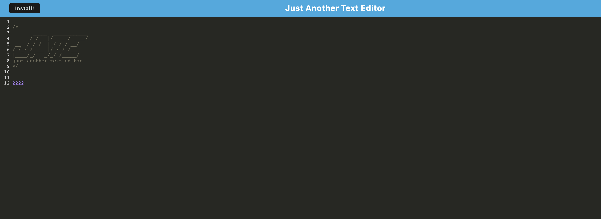

# Text-Editor-App
[](https://opensource.org/licenses/MIT)
## Description
Created a web app with self built webpack and service worker and made app installable

## Table of Contents
- [Installation Instructions](#installation-instructions)
- [Usage Information](#usage-information)
- [Test Instructions](#test-instructions)
- [Questions](#questions)
- [Application](#application)

- [Image](#image)


## Installation Instructions
```
npm i
```
## Usage Information
```
npm start
```
## Contribution Guidlines
Open Source

## Test Instructions
N/A

## License
This project is licensed under the terms of the [MIT](https://opensource.org/licenses/MIT) license

## Questions
My Github Profile: [cluck135](https://github.com/cluck135)

Email me your questions at: [casenluck@gmail.com](mailto:casenluck@gmail.com)

## Application
[Link to Deployed Application](https://text-editor-webpack2.herokuapp.com/)

## Image
